### P3: Lenguajes y Middlewares para Programación Distribuida

###### Salvador Romero Cortés

---

#### Ejemplos

* **Ejemplo 1:** Cuando se introduce un 0, el servidor se duerme durante 5 segundos

* **Ejemplo 2:** Cuando llega al servidor una hebra cuyo nombre acaba en 0 el servidor espera durante 5 segundos. La diferencia entre poner synchronized y no ponerlo es que si no lo ponemos el resto de hebras seguirán escribiendo mensajes en la terminal mientras duerme la hebra que acaba en 0. Si le ponemos synchronized el resto de hebras no escribirán en pantalla hasta que la hebra que acaba en 0 se vuelva a despertar. 

  | 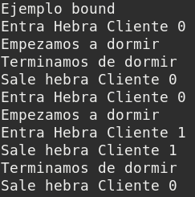 | 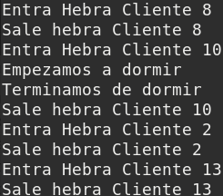 |
  | ------------------------------ | ------------------------------ |
  | Sin poner synchronized         | Poniendo synchronized          |

* **Ejemplo 3:** Nada especial que comentar. Cuando se ejecuta el cliente aumenta el contador 1000 veces y calcula el tiempo de respuesta.

### Servidor de donaciones

Vamos a montar un servidor con varias réplicas que permitan a los clientes donar dinero a una causa humanitaria. 

Hemos establecido 2 interfaces, una para la comunicación entre réplicas (Interfaz  `Ireplica`) y entre las réplicas y el cliente (Interfaz `IClienteServidor`). La clase `Replica` implementará estas dos interfaces de manera que se pueda comunicar con el resto de réplicas y con el cliente.

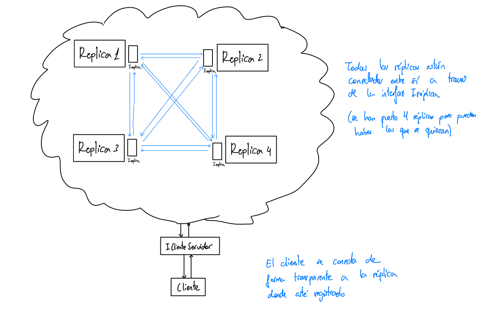

#### Funcionamiento

El funcionamiento del servidor desde el punto de vista del cliente se basa en registrarse, iniciar sesión y consultar el total de donaciones. El cliente no sabe a que réplica está conectado en el momento de hacer cualquier operación.

Cuando se inicia el cliente se le pide que elija una reṕlica inicial, aunque esta no tiene por qué ser con la que trabaje ya que si está registrado en otra réplica o no está registrado y hay una réplica con menos clientes entonces ya estará trabajando con otra réplica distinta de la que eligió (aunque el cliente no lo sabe).

Todas las réplicas tienen la misma funcionalidad y no existe ninguna superior a las demás. Las réplicas al construirse comprueban si existe un registro en el puerto 1099. Si no existe, lo crea y esa réplica sabe que fue la primera en crearlo. El resto de réplicas al iniciarse, verán que ya existe el registro y lo que harán será conectarse a las réplicas ya creadas. 

Todas las réplicas tienen una lista del resto de réplicas de la red que usarán para comprobar donde se debe registrar el usuario o donde debe iniciar sesión.

El mecanismo de agregar réplicas funciona de manera que los datos nuevos se propagan por toda la red de réplicas. De manera que si tenemos 2 réplicas que se tienen en la lista de réplicas mutuamente y agregamos una tercera, esta basta con que se añada cualquiera de las 2 anteriores para que toda la red conozca la nueva réplica. La siguiente imagen ilustra como se propaga el ejemplo comentado.

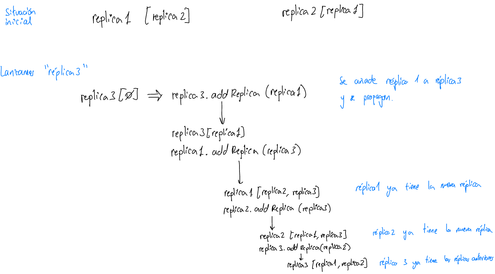

Este mecanismo se uso al principio de la práctica donde al lanzar una réplica hacía falta indicar alguna de las réplicas anteriores para que se agregasen. En la versión final las réplicas agregan todas las réplicas de la red de una vez y de manera recíproca. La propagación no se realiza de forma tan compleja porque se comprueba que ya han sido añadidas y no se vuelven a insertar.

El sistema de localizar el registro y de la autopropagación es muy cómodo porque nos permite lanzar tantas réplicas como y cuando queramos, sin tener que preocuparnos por nada porque se conectan de forma automática. De esta manera podemos tener 3 réplicas iniciales y después de algunas operaciones insertar una cuarta para distribuir la carga de los clientes.

Se han añadido dos funciones a las réplicas: inicio y cierre se sesión. De esta forma el cliente podrá registrar varios usuarios e iniciar sesión dentro de la misma ejecución del programa.

Las réplicas muestran por pantalla (la suya propia, oculta al cliente) mensajes de información sobre la propagación de réplicas o alguna acción del cliente (donación, registro o inicio de sesión).

El curso de una ejecución normal sería el siguiente: 

1. El cliente elige una réplica de las disponibles a conectarse
2. El cliente se registra si no tiene cuenta
3. La réplica a la que está conectada decide si es ella u otra la que debe registrar al cliente y le redirige a la que le toque.
4. El usuario queda registrado en la réplica que le tocó y ahora está conectado a esa.
5. El usuario inicia sesión.
6. La réplica comprueba de nuevo que el cliente está en la réplica correcta, lo redirige si es necesario y comprueba los datos de inicio de sesión.
7. Si las credenciales eran correctas, el cliente inicia sesión y ahora tiene disponible la opción de donar, consultar el total y cerrar sesión.
8. El cliente dona en la réplica donde está conectado.
9. El cliente ahora puede consultar el total y lo consulta. La réplica solicita el resto de réplicas sus subtotales y devuelve el total global.
10. El cliente cierra sesión y sale del programa.

Diagrama de secuencia del ejemplo anterior:

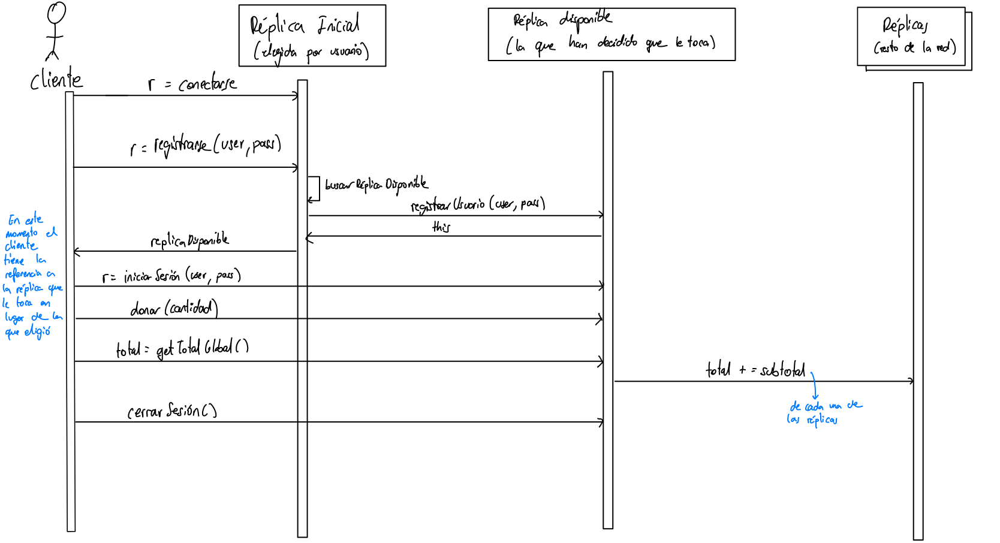

Para el cálculo del total, la réplica del cliente solicita al resto de réplicas sus subtotales.

#### Ejecución del programa

Primero debemos compilar los ficheros

```bash
javac *.java
```

Para ejecutar el programa, primero debemos lanzar las réplicas (tantas como queramos). Para lanzar una réplica usaremos la clase "BootReplica" que se encarga de crear réplicas:

```bash
java -cp . -Djava.security.policy=server.policy BootReplica [id]
```

Donde [id] es un campo opcional donde indicar el id de la réplica (número entero).

Podremos lanzar tantas réplicas como queramos con el comando anterior.

Para lanzar el cliente usaremos

```bash
java -cp . -Djava.security.policy=server.policy Cliente
```

El programa principal del cliente ya nos guiará para el registro, inicio de sesión y demás operaciones disponibles.

#### Capturas

Lanzando réplicas 

| Réplicas  | Captura          |
| --------- | ---------------- |
| Réplica 0 | 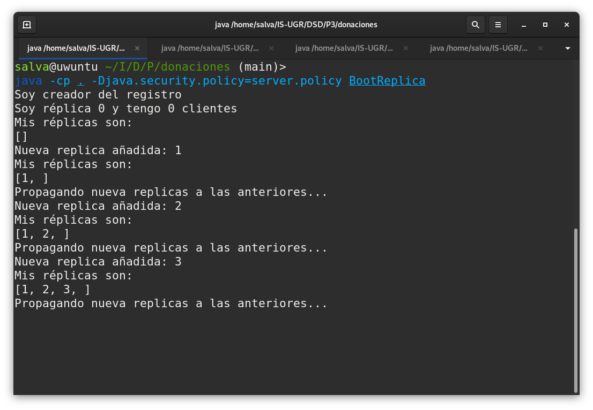 |
| Réplica 1 | 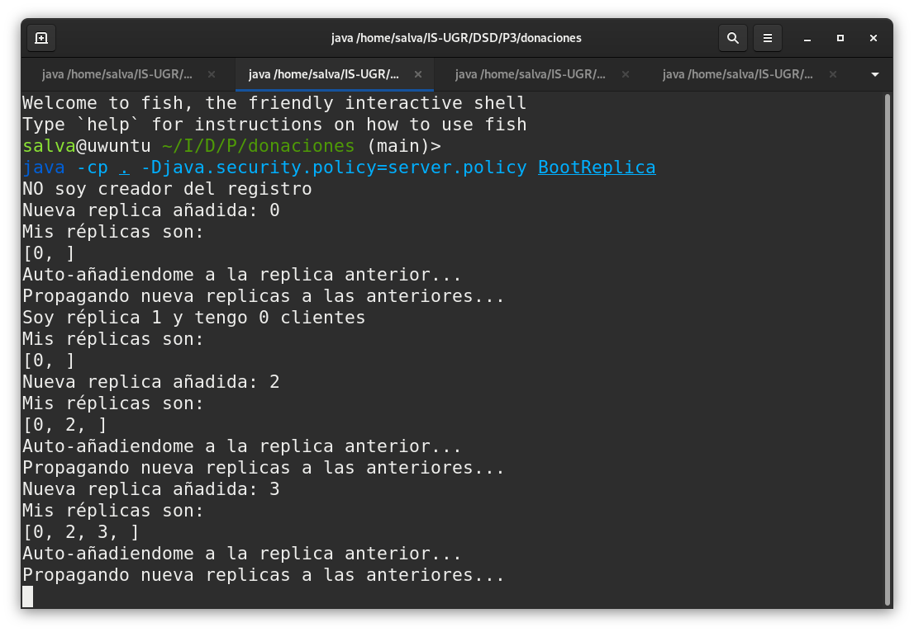 |
| Réplica 2 | 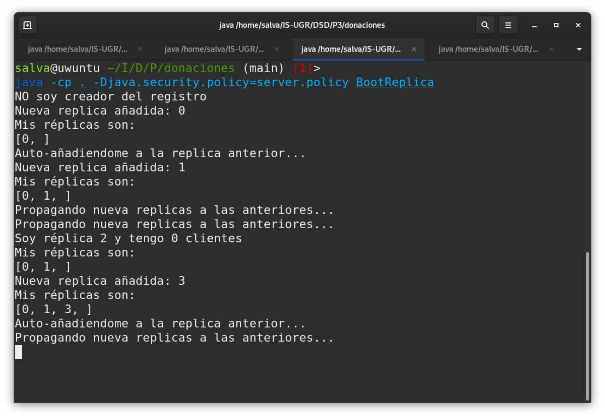 |
| Réplica 3 | 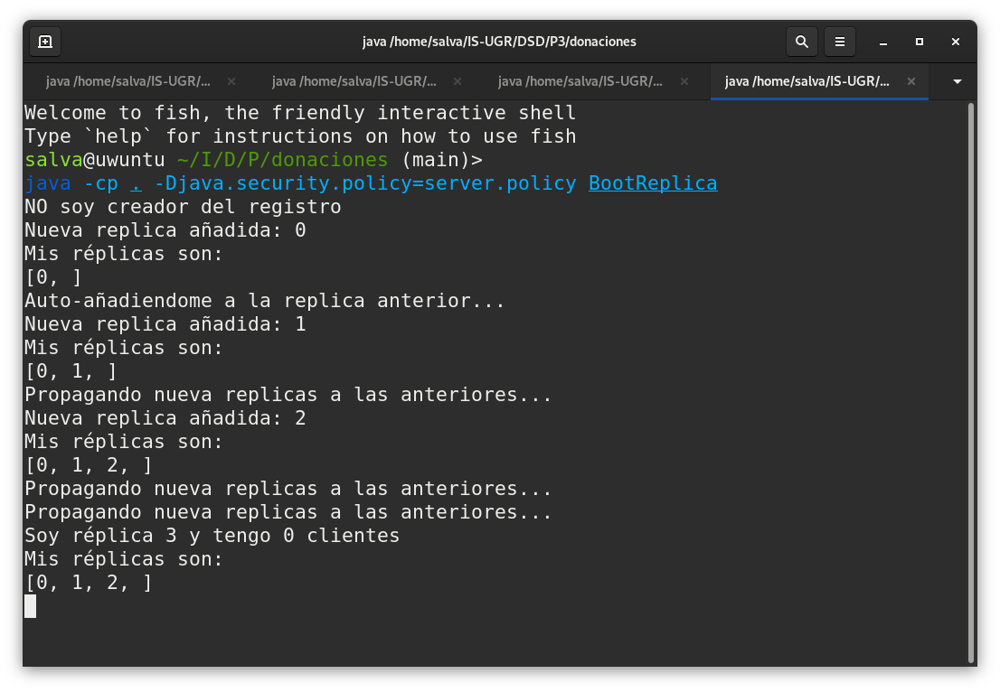 |

Ejecutando el cliente:

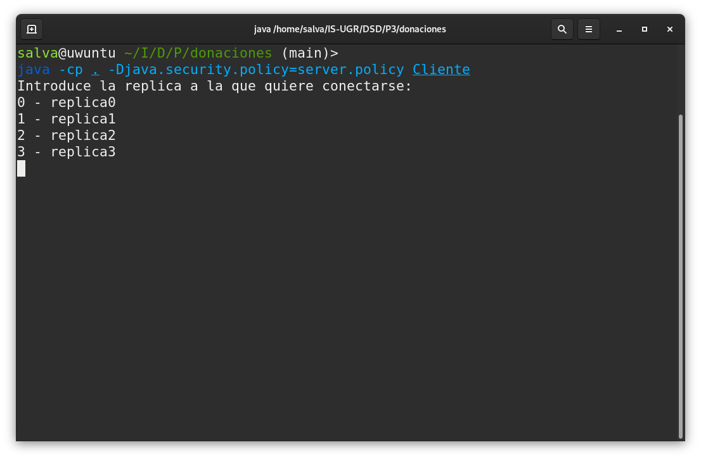

Registrando un usuario:

| 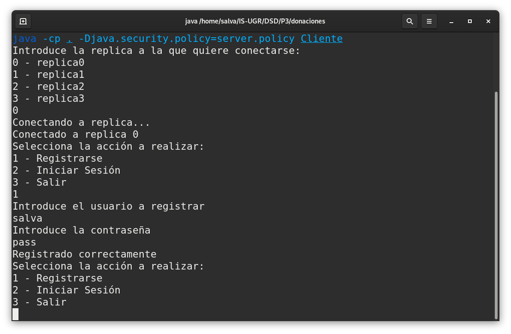 | 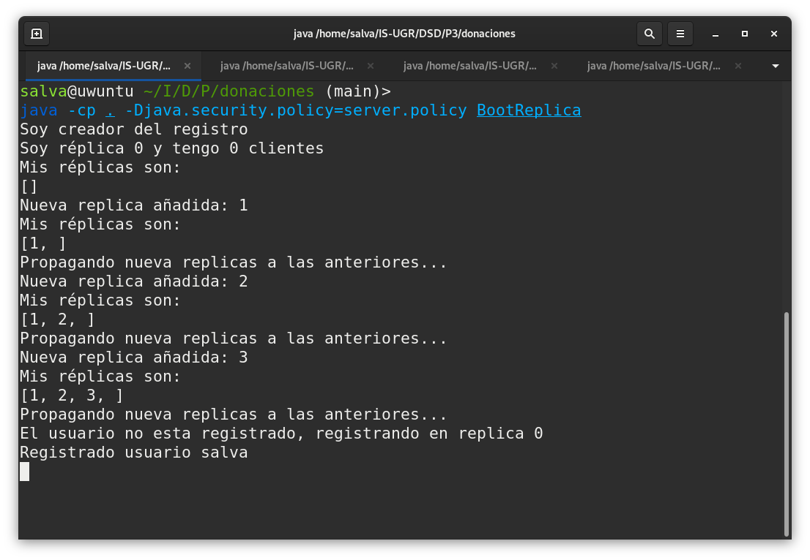         |
| ------------------------ | -------------------------------- |
| Cliente                  | Réplica del registro (Réplica 0) |

Registrando otro usuario (veremos que se registrará en una réplica distinta)

| 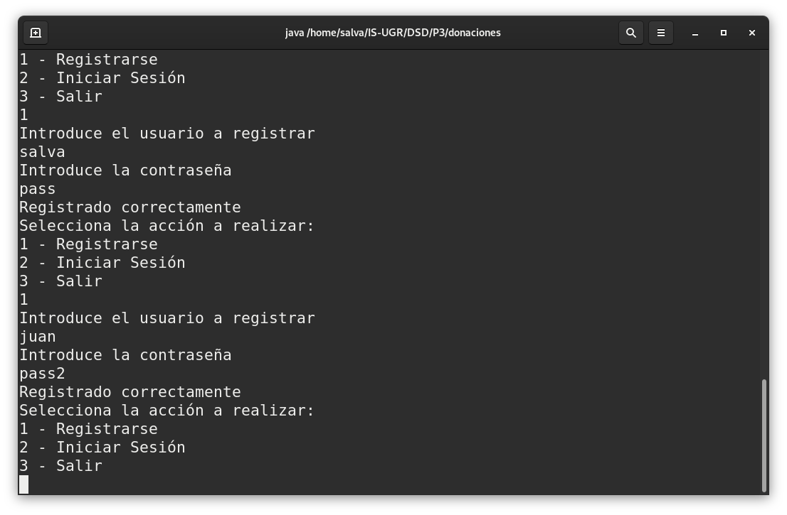 | 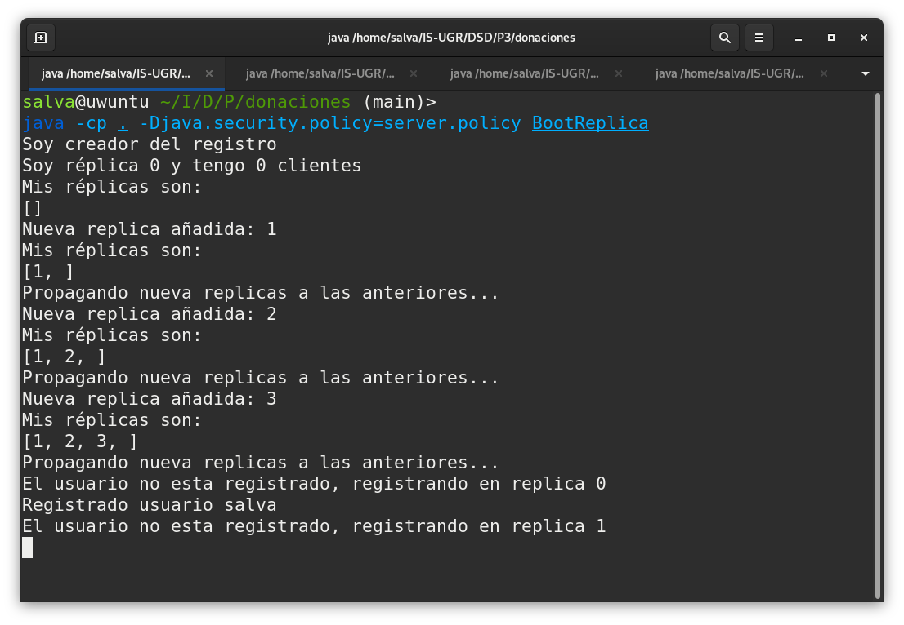                | 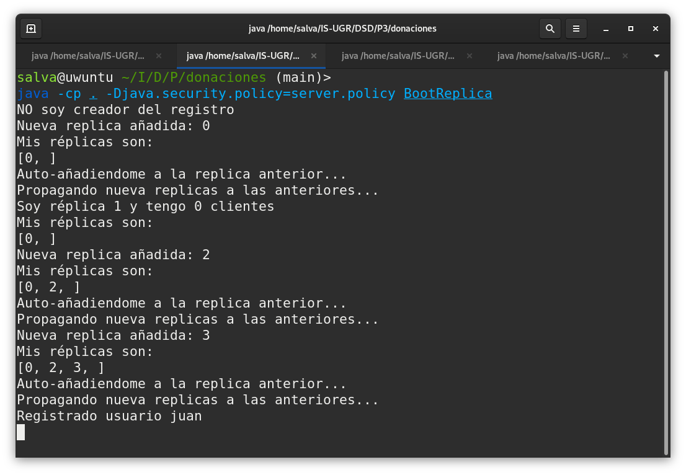                                 |
| ------------------------- | ----------------------------------------- | ---------------------------------------------------------- |
| Cliente                   | Réplica 0 (réplica del anterior registro) | Réplica 1 (la que se ha decido que debe hacer el registro) |

Si ahora iniciamos sesión con "salva" (se registró en réplica 0) veremos que se volverá a cambiar a la réplica 0.
| 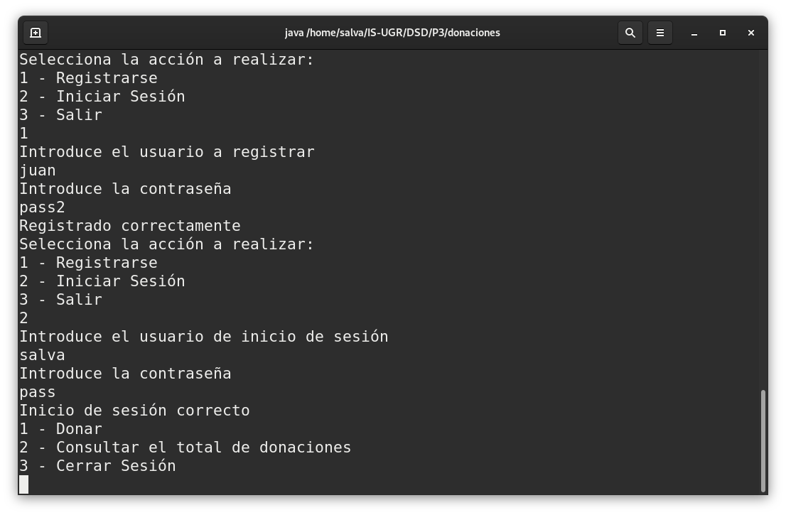 | 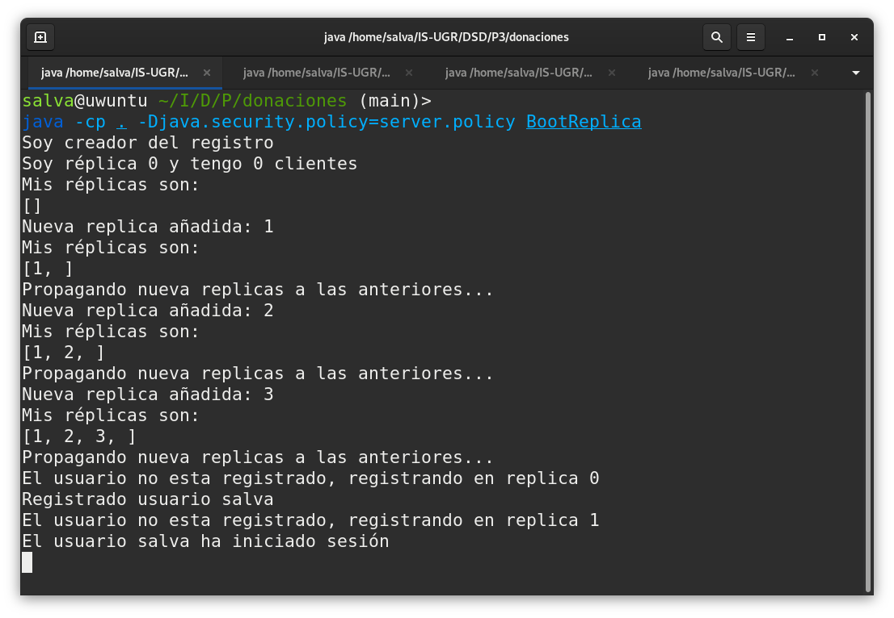                | 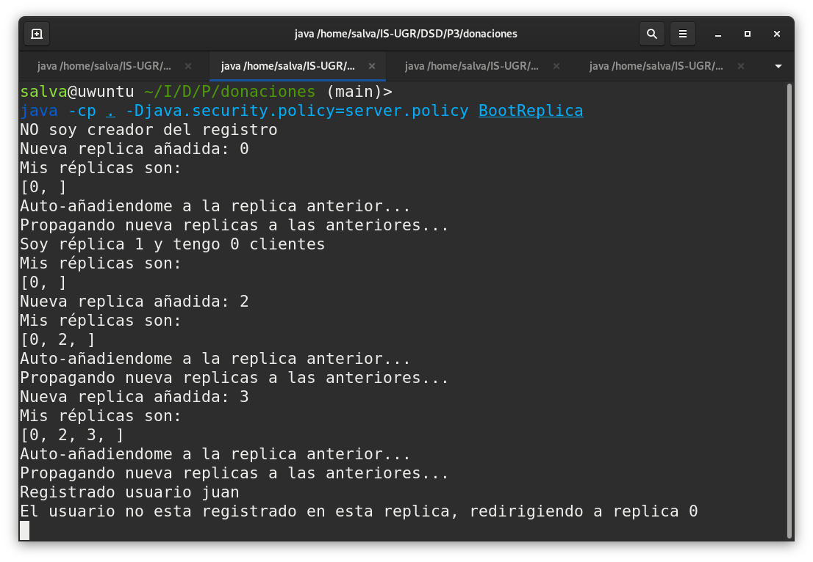                                 |
| ------------------------- | ----------------------------------------- | ---------------------------------------------------------- |
| Cliente                   | Réplica 0 (réplica donde se registró) | Réplica 1 (donde estabamos actualmente) |

Ejemplo de donación: ambos donan cantidades distintas (y en réplicas distintas)

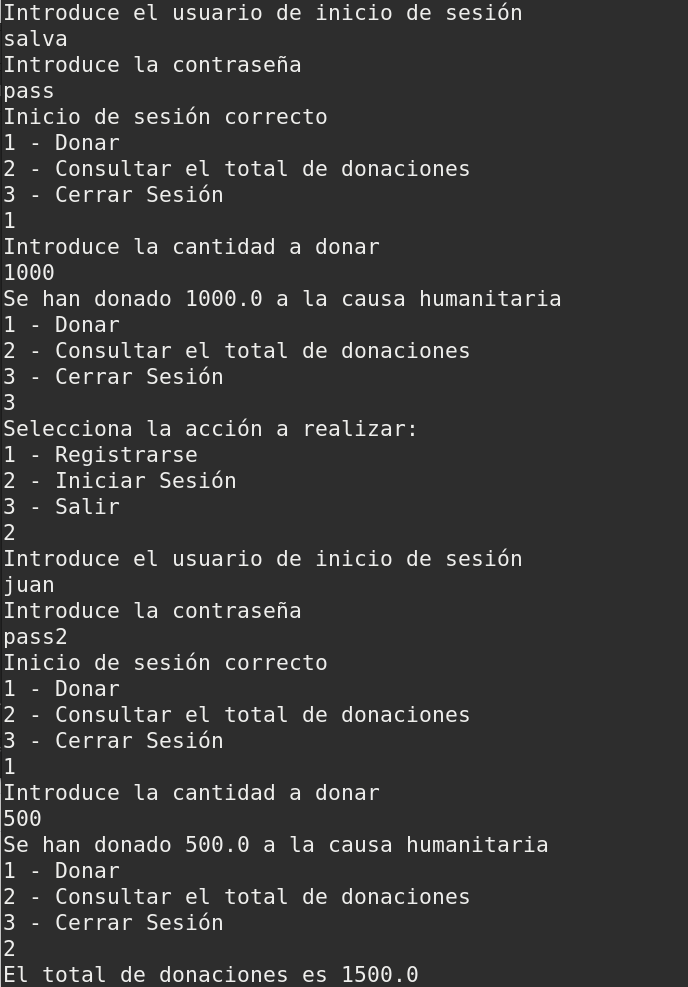
