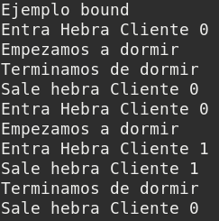
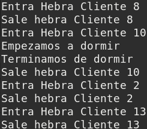

### P3: Lenguajes y Middlewares para Programación Distribuida

###### Salvador Romero Cortés

---

#### Ejemplos

* **Ejemplo 1:** Cuando se introduce un 0, el servidor se duerme durante 5 segundos

* **Ejemplo 2:** Cuando llega al servidor una hebra cuyo nombre acaba en 0 el servidor espera durante 5 segundos. La diferencia entre poner synchronized y no ponerlo es que si no lo ponemos el resto de hebras seguirán escribiendo mensajes en la terminal mientras duerme la hebra que acaba en 0. Si le ponemos synchronized el resto de hebras no escribirán en pantalla hasta que la hebra que acaba en 0 se vuelva a despertar. 

  |  |  |
  | ------------------------- | ------------------------- |
  | Sin poner synchronized    | Poniendo synchronized     |

  

